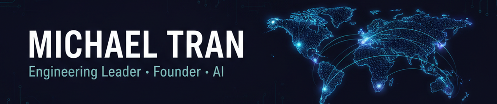

<p align="center">
  
</p>

<p align="center">
  Sydney → working globally<br/>
  <em>I help engineering teams launch, ship, and embed AI — without the usual hiring risk.</em>
</p>

<p align="center">
  <a href="mailto:michael@xstep.au"></a>
  <a href="https://linkedin.com/in/m1chaeltran"></a>
  <a href="https://carely.au"></a>
</p>

---

### The problem you're probably here to solve

You need to **launch a product into a new market**, **scale an engineering team that's stuck**, or **get AI properly embedded** into how your team ships. The roadmap is real, the timeline is unreasonable, and most of the senior leaders you've interviewed can do *one* of those — not all three.

Hiring wrong is expensive: lost quarters, missed launches, a team that loses faith in the next leader you bring in. Hiring slow is just as bad.

You don't need another generic engineering leader. You need someone who has done this exact shape of problem before, can come in lean, and won't fold when the integrations get messy.

That's where I come in.

---

### What you get when you work with me

I'm an engineering leader and founder who **launches markets, ships product on lean teams, and embeds AI into how engineering orgs work** — backed by 18+ years across enterprise (Westpac, Optus, Qantas, LJ Hooker, Ansarada) and high-growth product environments.

The pattern: I get brought in when something needs to ship, the team is lean, and the integrations are messy.

Right now I'm leading engineering for **Omaze's international launch programme** — I delivered the German market end-to-end **in under 3 months** on a 2-person internal team plus a Shopify agency, owning architecture, integrations, and delivery. Alongside that, I run **Xstep** (AI consultancy) and **Carely.au** (NDIS expansion of AutoLegen).

---

### The plan — how working together usually goes

```text
1.  We talk             →  30 minutes. You describe the problem; I tell you honestly if I'm the right person.
2.  Scope the engagement →  Contract, fractional leadership, or full-time. We pick what fits.
3.  I land lean          →  Day one I'm reading code, talking to your team, mapping vendors and risks.
4.  We ship              →  First measurable win in weeks, not quarters. Real outcomes, not slideware.
5.  AI gets embedded     →  Workshops + working sessions so your team ships faster long after I'm gone.
```

---

### Selected work — proof, not promises

<table>
<tr>
<td width="50%" valign="top">

#### 🌍 Omaze — European launch
**Role** &nbsp;Engineering Lead, International Launch
**Team** &nbsp;2 internal + Shopify agency
**Result** &nbsp;Live market in <3 months

End-to-end engineering for a UK fundraising platform's expansion into a new European market. Shopify front-end wired into AWS Lambda / Node.js draw + fulfilment, KYC, Stripe, Recharge, PostHog. Took a second market to near-launch before the regional rollout was paused.

</td>
<td width="50%" valign="top">

#### 🏥 Carely.au — NDIS automation
**Role** &nbsp;Founder & builder
**Stage** &nbsp;Live, growing

A dedicated NDIS-sector platform applying an AI-automation playbook to a regulated care market. Built end-to-end from positioning through product.

</td>
</tr>
<tr>
<td width="50%" valign="top">

#### 🛠️ Xstep — AI consultancy
**Role** &nbsp;Founder & director
**Focus** &nbsp;Senior engineering & AI delivery

Senior contract engineering and bespoke AI builds for clients. Architecture, delivery, and small offshore/onshore teams for AI-led web, automation, and data-integration work.

</td>
<td width="50%" valign="top">

#### 🧠 AI in delivery — Omaze internal programme
**Role** &nbsp;Programme lead
**Audience** &nbsp;UK engineering team

Designed and ran workshops on AI-assisted delivery — identity-coding, agentic workflows, day-to-day tooling. Goal isn't "use ChatGPT more"; it's making AI a load-bearing part of how engineers ship.

</td>
</tr>
</table>

---

### ⚛️ Stack I work with

**Languages**
<p>
  
  
  
  
  
  
  
  
  
</p>

**Backend & frameworks**
<p>
  
  
  
  
  
  
  
  
  
  
</p>

**Frontend & mobile**
<p>
  
  
  
  
  
  
  
  
  
  
  
  
  
</p>

**Cloud & infra**
<p>
  
  
  
  
  
  
  
  
  
  
  
  
  
  
</p>

**Data & analytics**
<p>
  
  
  
  
  
</p>

**Commerce, payments & integrations**
<p>
  
  
  
  
  
  
</p>

**Testing & quality**
<p>
  
  
</p>

---

### Track record

> 18+ years across enterprise and high-growth product. Below are the roles, the companies, and how long I stayed.

| Role | Company | Years | Duration |
|---|---|---|---|
| Engineering Lead, International Launch | **Omaze** | 2024 — present | 2y+ |
| Engineering Manager | **A2B Australia** | 2023 — 2024 | 8 mo |
| Founder & Director · NDIS automation | **Carely.au** | 2023 — present | 3y+ |
| UI Tech Lead | **Westpac** | 2022 — 2023 | 9 mo |
| Full Stack Tech Lead | **Optus** | 2022 | 6 mo |
| VP of Engineering | **Nstep** | 2021 — 2022 | 7 mo |
| Founder & Director · AI consultancy | **Xstep** | 2021 — present | 4y+ |
| Head of Engineering | **LJ Hooker** | 2018 — 2021 | 3y 9mo |
| Full Stack Tech Lead | **Qantas (Innovation Lab)** | 2017 — 2018 | 1y |
| Tech Lead | **Ansarada** | 2012 — 2016 | 4y |
| Senior Engineer | **Sinclair Knight Merz (SKM)** | 2010 — 2012 | 2y 7mo |
| Software Engineer | **Global Gossip** | 2007 — 2010 | 3y |

---

### Why teams hire me

- 🚀 **I ship.** End-to-end market launches under real timeline pressure — not slideware.
- 🛠️ **I'm hands-on across the stack.** Shopify, AWS, Node / TS, React / Next, Stripe, Recharge, n8n, PostHog. I read your code, I don't just review it.
- 🧠 **I make AI a load-bearing part of how your team works.** Workshops, identity-coding, agentic workflows — not a Slack channel full of ChatGPT screenshots.
- 🤝 **I orchestrate vendors and agencies** so your internal team stays small and focused.
- 🌱 **I own outcomes**, not tickets. Founder/operator instincts, hired-gun discipline.

---

### 📊 Stats

<p align="center">
  
  
</p>

---

### Let's talk

If you're a **CTO or founder** scaling a team, launching into a new market, or trying to get AI properly embedded into how your engineers ship — let's have a 30-minute conversation. If I'm not the right fit, I'll tell you, and probably point you to someone who is.

If you're a **recruiter** with a senior engineering or AI leadership brief — Head of Engineering, VP Engineering, Head of AI, founding engineer, 0→1 launch — the quick facts are below. Email is fastest.

**Quick facts**
- **Based:** Sydney, Australia · Australian citizen, no sponsorship needed
- **Mode:** Remote-first; happy to flex hours for UK / EU / US overlap
- **Open to:** senior contract engagements (preferred) or the right full-time leadership role
- **Reachable at:** [michael@xstep.au](mailto:michael@xstep.au) — usually within a business day

📧 **[michael@xstep.au](mailto:michael@xstep.au)** &nbsp;·&nbsp; 💼 **[LinkedIn](https://linkedin.com/in/m1chaeltran)** &nbsp;·&nbsp; 🏥 **[carely.au](https://carely.au)**
